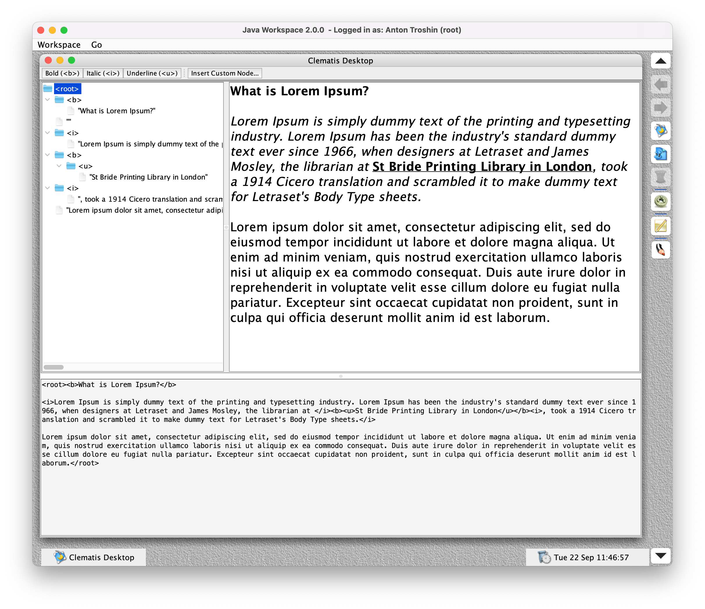

# Visual XML Editor Plugin for Clematis Java Workspace

A simple visual XML editor for producing rich text with bold, italic, and underline formatting, backed up by an XML document tree structure. The editor rebuilds the XML document tree in real time following text modifications. Also, the editor is able to work with any custom node.

## Clematis Java Workspace

Please visit this [repository](https://github.com/grauds/clematis.desktop) to download a copy of Clematis Java Workspace to work with this plugin.

## Key Features

- **XML Document Tree Structure**: Represents XML documents as a hierarchical tree of nodes with support for tags, text
  content, and parent-child relationships
- **WYSIWYG Editing**: Real-time visual editing of XML content with automatic UI refresh and caret position tracking
- **Document Filtering**: Custom document filter that intercepts and processes text insertion, replacement, and deletion
  operations
- **XML Markup Generation**: Converts the internal node tree structure back to XML markup format
- **Node Manipulation**: Provides methods to add, remove, and retrieve child nodes at specific positions in the tree
- **Text Node Support**: Special handling for text-only nodes within the XML structure
- **Event-Driven Architecture**: Callback-based system for UI updates and caret positioning during document
  modifications
- **Toggle Control**: Ability to enable/disable document filtering to allow direct text manipulation when needed
